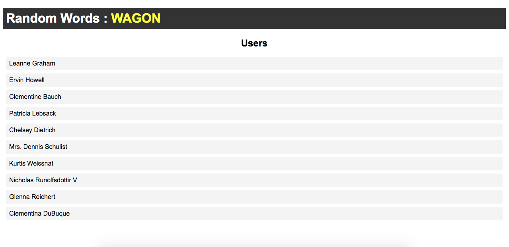

# netlify-dev

Playing around with netlify dev and deploy.



## Quick Start

```bash

# Install netlify-cli globally

npm i -g netlify-cli

# Login to your netlify account using netlify-cli

netlify login

# Initialize netlify project

netlify init

# Create a netlify function

netlify functions:create 'function-name'

# Deploy to netlify

netlify deploy --prod

# Serve on localhost

netlify dev

# Serve on a live url

netlify dev --live

```
